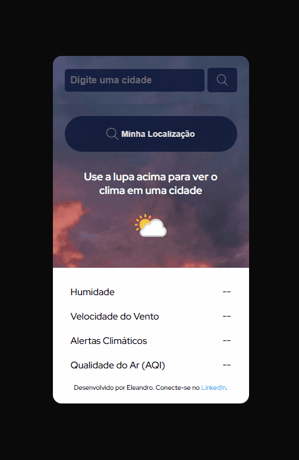

# Weather Forecast Application

This is a weather forecast application that provides real-time weather information using the WeatherAPI. Initially developed as part of a challenge from the **DevGuest** course, the app was designed to be simple but has been enhanced with additional features to improve its functionality and user experience.

## Features

- **Search by City**: Enter the name of a city to get its current weather information.
- **Geolocation**: Automatically fetch weather data based on the user's current location.
- **Dynamic City Suggestions**: Suggestions for city names appear as the user starts typing.
- **Weather Alerts**: Displays weather alerts for the selected location, if available.
- **Air Quality Index (AQI)**: Provides information about the air quality in the selected location.
- **Real-time Weather Data**: Displays temperature, weather conditions, humidity, wind speed, and more.

## Technologies Used

- **HTML5**: For structuring the application.
- **CSS3**: For styling with a Mobile-first approach.
- **JavaScript (ES6+)**: For application logic and API integration.
- **WeatherAPI**: The source of weather data.

## How to Use

1. **Search by City**:
   - Enter the name of a city in the search field and click the magnifying glass to view the weather forecast.
2. **Use Geolocation**:
   - Click the "Minha Localização" button to fetch weather data based on your current location.
3. **Dynamic Suggestions**:
   - Start typing a city name in the search field to see suggestions for matching cities.
4. **View Weather Details**:
   - The app displays temperature, weather conditions, humidity, wind speed, air quality, and weather alerts.

## Screenshot

 

## About the Project

This project was initially developed as part of a challenge from the **DevGuest** course. The original challenge was to create a basic weather forecast application. However, the following additional features were implemented independently to enhance the app:
- Geolocation to fetch weather data based on the user's current location.
- Weather alerts for the selected location.
- Air Quality Index (AQI) information.
- Dynamic city suggestions as the user types.

## Author

Developed by **Eleandro**.

- **LinkedIn**: [Eleandro Mangrich](https://www.linkedin.com/in/eleandro-mangrich)
- **GitHub**: [Eleandro1302](https://github.com/Eleandro1302)

## License

This project is free to use.

